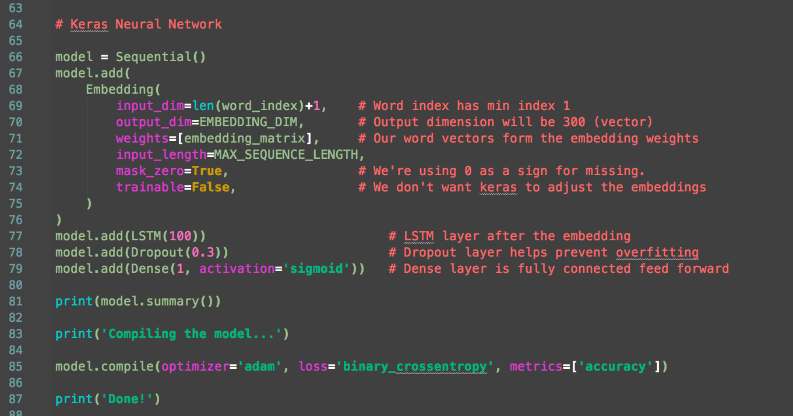

Dan Dietz
boltaffect.com
dan@boltaffect.com

 

---

# Artificial Intelligence is just a pipe dream.

---

# An __introduction__ to machine learning through text classification with Keras and TensorFlow.

---

# Don't miss the important word "introduction"

1. I am a professional python developer
2. I am not a machine learning expert
3. I am an engineer, not a (data) scientist. 

Just like engineers don't care how concrete cures, just that it cures strong enough for the job; I don't care how machine learning works just that it gets the job done.

---

# Machine Learning or AI?

___

# I like "artificial intelligence"

Two reasons:

 1. It sounds more sinister than "machine learning"
 2. It sounds more sinister than "machine learning"

---

# You can't ask the computer WHY it made the decision it made

 * Are the decisions the computer is making fair?
 * Are the decisions the computer is making moral?

Well why is that? Reasons...

---

# A quick story

 

---

# Decision making through trees

---

# Neural Network

---

# Training

---
# The Job at Hand

---

# Text classification

The problem I'd like to solve is to categorize blocks of text by tagging them.

---

# This has been done... many times

The most popular approach to this problem is to create what is called a __bag of words__. 

You convert all the text to individual words. Then you count the number of occurrences of each word.

If a block of text has a high occurrence of the word "poorly" we might tag that text as being negative. If, however, there is a high occurrence of the word "superbly" then we might tag that text as being positive.

---

---

### Great, just do that!

The bag of words method is only about 90% accurate. 90% sounds pretty good, but not if we're trying to automate something a person does with close to 100% accuracy. 

Why is it only 90% accurate? 

---

# Problem

---

## The order of words matters.

“Unlike the surreal Leon, this movie is weird but likable.”
“Unlike the surreal but likable Leon, this movie is weird.” [1](#footnote1)

---

# Another approach: Neural Network

---

# Problem

---

Using a neural network is about 90% accurate because they process data sequentially, like bag of words.

---

# But I thought neural networks were the solution!!

---

# Enters a Recurrent Neural Network

---

Feed the output back into the previous layers. Developed in the 80's...

---

# Problem

---

The training process is long and messy. Bring your super computer to the training session.

---

# Long-Short Term Memory Neuron

Developed and tested 2007-2011 and finally we started to get performance gains above 93% accuracy.

Used by google for speech translation.

Andrej Karpathy (now Director of AI) for Tesla wrote about LSTM Neurons while getting his PHD in machine learning.

---

 

---

 

---

PANDARUS:
Alas, I think he shall be come approached and the day
When little srain would be attain'd into being never fed,
And who is but a chain and subjects of his death,
I should not sleep.

Second Senator:
They are away this miseries, produced upon my soul,
Breaking and strongly should be buried, when I perish
The earth and thoughts of many states.

---

---

# Remember how I said you can't ask the computer WHY? Yeah...

---

# And one last thing before we code....

---

# Some Math. How hard can some Linear Algebra be?

---

---

# Convert words to "vectors"

 * The word vector comes from linear algebra
 * Vectors are just a big list of numbers
 * We convert each word to a list of numbers that represent that word
 * Each list is 300 numbers long
 * Or we would say each vector has 300 dimensions.

---

# Huh? Why Vectors?

* Vectors are special because they have rules on how you can do math with them
* You can add two vectors, multiply them, divide them, etc.

---

Words as a vector with just three dimensions:

---

# Look ma, no hands!

---

# Gensim has vectors

---

---

# With your powers combined...

---

# Vectors unite with LSTMs!

1. Word vectors encapsulate word meanings
2. LSTMs train to remember context of the text sequences

---

# Libraries

1. Tensorflow - Google's machine learning library
2. Keras - Python API to configure tensorflow neural network

 

---

# Example

---

Sermon data:

Family 1: tagged as relates to family issues
Family 0: tagged as relates to the general topic of faith

---

# Using pandas to pull data into project

---

# Three Layer Neural Network

 1. Embedding Layer: Converts words to sequence of words to a matrix of vectors
 2. LSTM Layer: learns relationships between words
 3. Dense Layer: Compresses LSTM output to probabilities

---

# Data for Embedding

---

---

$ pipenv run python demo.py
Using TensorFlow backend.
Found 7870 unique tokens
Shape of data tensor: (20, 50000)
Shape of label tensor: (20,)

---

---

---

---

# Slides & Code

[https://github.com/paperreduction/gvlpython-wagtail](https://github.com/paperreduction/gvlpython-tensorflow)

Dan Dietz
boltaffect.com
dan@boltaffect.com

 

---

# Sources

http://joelgrus.com/2016/05/23/fizz-buzz-in-tensorflow/
https://www.youtube.com/watch?v=BgBrYpihvLY
https://machinelearningmastery.com/gentle-introduction-vectors-machine-learning/
https://en.wikipedia.org/wiki/Ground_truth
https://machinelearnings.co/tensorflow-text-classification-615198df9231
https://github.com/tensorflow/tensorflow/blob/master/tensorflow/examples/learn/text_classification.py
https://github.com/tensorflow/tensorflow/tree/master/tensorflow/examples/learn#text-classification
https://www.tensorflow.org/hub/tutorials/text_classification_with_tf_hub
http://ruder.io/text-classification-tensorflow-estimators/
https://medium.com/quantitative-technologies/text-classification-with-the-high-level-tensorflow-api-390809987a4f
https://www.youtube.com/watch?v=KcS6nVUT3Gc
https://www.youtube.com/watch?v=WCUNPb-5EYI
http://karpathy.github.io/2015/05/21/rnn-effectiveness/
https://engineering.stanford.edu/magazine/article/stanford-algorithm-analyzes-sentence-sentiment-advances-machine-learning
https://machinelearningmastery.com/overfitting-and-underfitting-with-machine-learning-algorithms/

